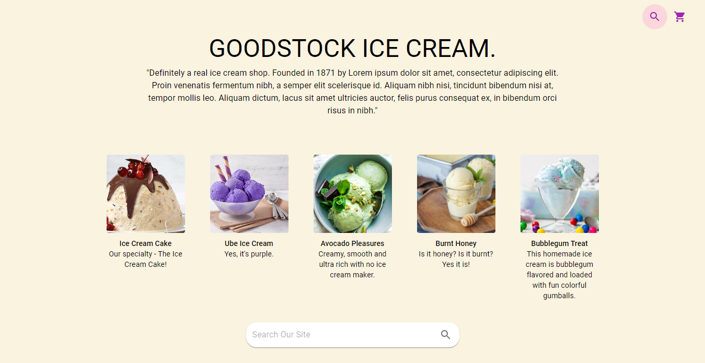
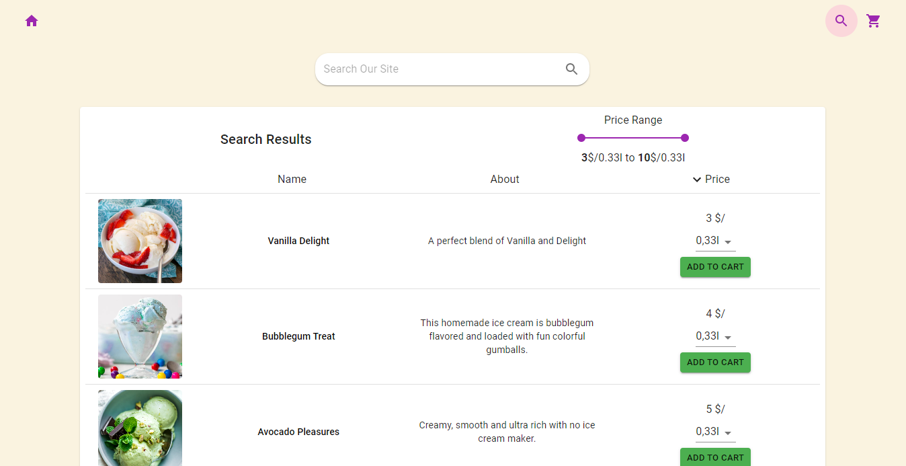
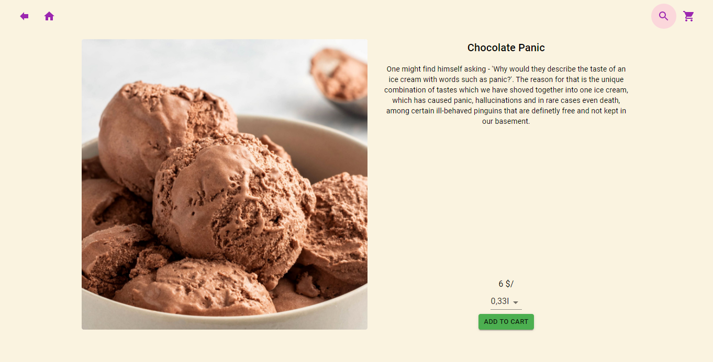
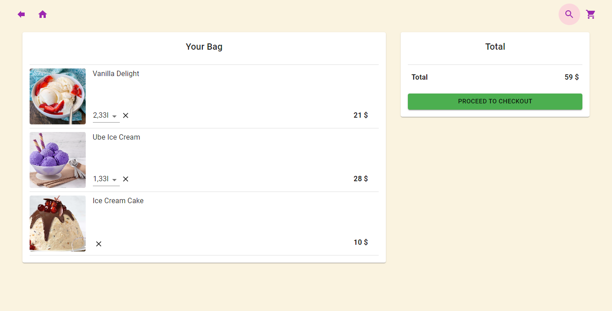

# React Ice Cream Store

An Ice Cream E-Commerce Frontend done with React and Material UI.

## Main Components

The project has 4 main components:

### Main (home)

The name and description of the store, along with 5 random items and a predictive search.

### Search

Search results, updates as the user types. Option to filter by price and to sort by name or price. User can add items to cart from here.

### One Item

One item page, shows longer description of the item and the option to add to cart.

### Cart

Shows all items in the cart, each item is removable and its quantity is editable.